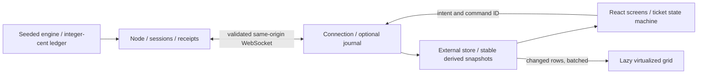

# Strike Desk

A five-day options game with six fictional companies and $1,000,000 of pretend money. Choose a 15-, 5-, or 2-minute pace, read source-rated news, and buy at most one whole-ticket position each day using at most half your cash. Buy UP/call or DOWN/put, cash out during trading, hold to the bell, or sit out. A paying ticket can still lose money after its premium.

This is the Fable interface with selected donor improvements. It preserves the numbered builder, company glyphs/colors, real/hope value bar, authoritative what-if scenarios and annotated chart.

## Two ways to explore

**Play and review.** Choose company, direction, target and budget using cards, chips or a custom whole-dollar amount. All companies have full-width cards, with a no-news variant; edge fades indicate more cards in the scrollable list. Comparison collapses the news rail, keeps a compact chart above a wide table and retains the ticket beside it. Company chips update the chart and builder together; side and affordability filters remain independent. Inspect received chart points with the pointer or arrow keys. At the bell, see the actual news outcome and the ticket's cost, proceeds and profit/loss. Select each final-chart day to review its records.

**Inspect the engineering.** Open **Under the hood**, then its separate-tab workload link, `/?board=2500&dev`. The same grid shows 2,508 real contracts; normal play has 252 (six companies × 21 targets × two directions). `?dev` exposes the connection-drop control. Complete quote scenarios normally refresh about every 1.5 seconds while table prices stream between them. Budget-dependent grid costs are hidden; both UI and server refuse trading in workload mode.

## Architecture



The server owns time, money, pricing, quantities and settlement. The browser validates messages, displays authoritative values and submits intent. Engine imports stay outside the browser. Normal streams send complete frames; workloads add quote batches with periodic complete frames. One ordering rule rejects older data. Narrow subscriptions isolate clock, account, news and ticket consumers; changing grid rows bypass React.

## Run and verify

Use **Node 24** and **pnpm 12.5.1**, as pinned in this repository.

```sh
pnpm install --frozen-lockfile
pnpm dev                 # server :10000, Vite :5173
pnpm typecheck
pnpm lint
pnpm test
pnpm build
pnpm check:bundle
pnpm check:css
pnpm smoke
pnpm simulate 1000
pnpm start               # built server and page :10000
```

This Windows session used temporary official Node 24.21.0 and pnpm 12.5.1 because system Node was 22 and its pnpm launcher was broken. Repository pins and lockfile remain intact. Use `pnpm test --maxWorkers=2` on resource-constrained machines. See [verification](docs/VERIFICATION.md), [P01–P11 status](docs/PORT_STATUS.md), [model audit](docs/MODEL.md), [decisions](docs/DECISIONS.md) and [Render handoff](docs/RENDER.md).

## Recovery

- One unanswered money-changing intent is recorded before sending: original ID/payload, session, day and submission time. Refresh checks receipts first. Eligible requests up to 20 seconds old may retry automatically with the same ID; older ones wait for **Retry safely**. Changed days, closed positions, finished/expired sessions cannot turn an old intent into a new trade.
- Moved-price rejections require a fresh quote and a deliberate new purchase. Repeated commands resolve through receipts without a second debit. Drafts are resent after reconnect because they belong to the socket.
- Final results survive refresh while the server retains the session. **Play again** clears the corresponding session/journal and reloads with a new connection.
- Storage is optional and guarded. Without it, same-tab recovery works but refresh recovery is not guaranteed. Normal/workload sessions have separate keys.
- Sessions live in server memory, with a 30-minute disconnected lifetime. Restart, redeployment and expiry lose games. No database, authentication or multiplayer is implied.

## Evidence and limits

The fresh audit covers 1,000 seeds under four policies (4,000 games), with zero rejected commands. [Recorded distributions](docs/model-audit.json) describe this fictional model, not real-market returns. No model parameters were tuned to a gain-rate target. Headlines are curated; there is no live-news or LLM dependency.

Workload measurements distinguish received records/s, accepted changed records/s, receipt-to-visible-cell observation delay p50/p95, animation-frame interval p50/p95 and long tasks. Client delay excludes network latency and is not physical paint time. Paused, collecting and unsupported differ from zero. Previous benchmarks from either repo are historical, not measurements of this port.

Fresh screenshots, desktop/phone visual checks and browser workload observations remain pending: no browser was available to the automation tool. Existing `docs/screenshots/` images are historical Fable references. At accelerated workload paces the chart waits for complete history when batches skip indexes; it never fabricates points. Only the read-only workload has a 3-second silence threshold to avoid cadence-related flicker; normal trading retains 1.5-second stale blocking.

This branch was not deployed or verified on the public service. Follow the [deployment and rollback checklist](docs/RENDER.md) before release. Company marks remain local SVG glyphs; Lexend and Unbounded fonts remain bundled.
