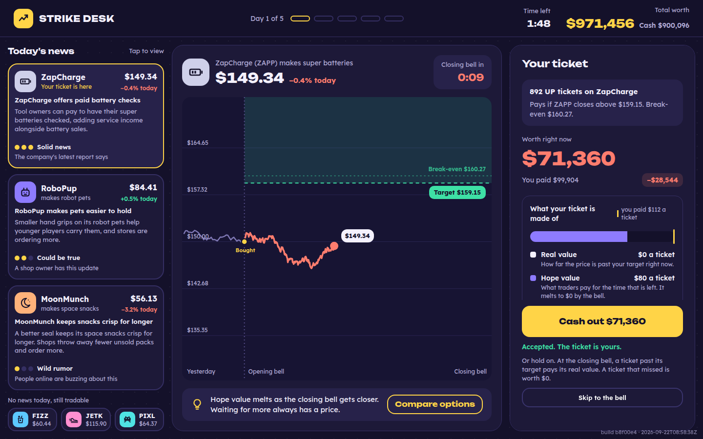
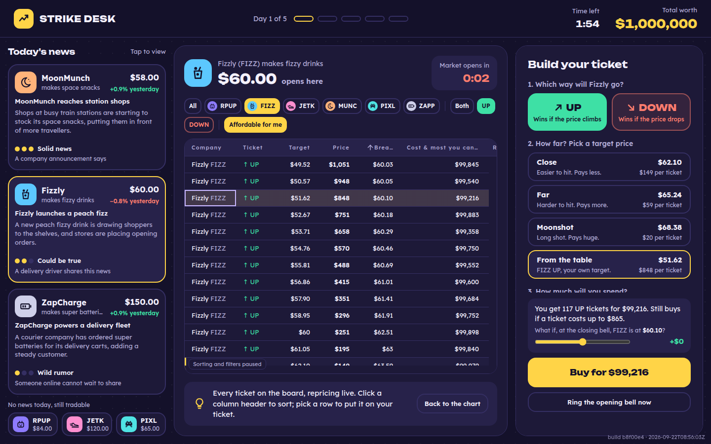
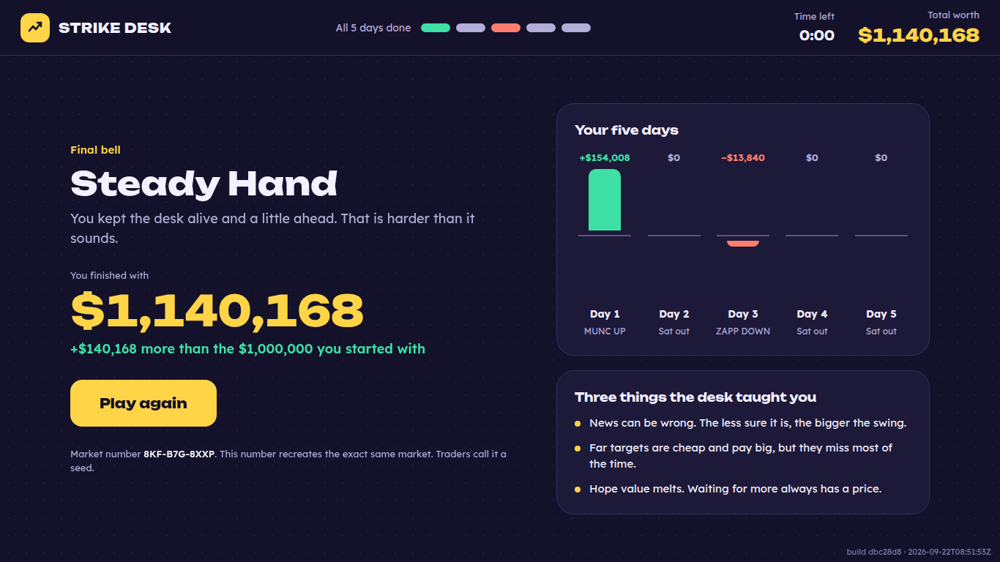
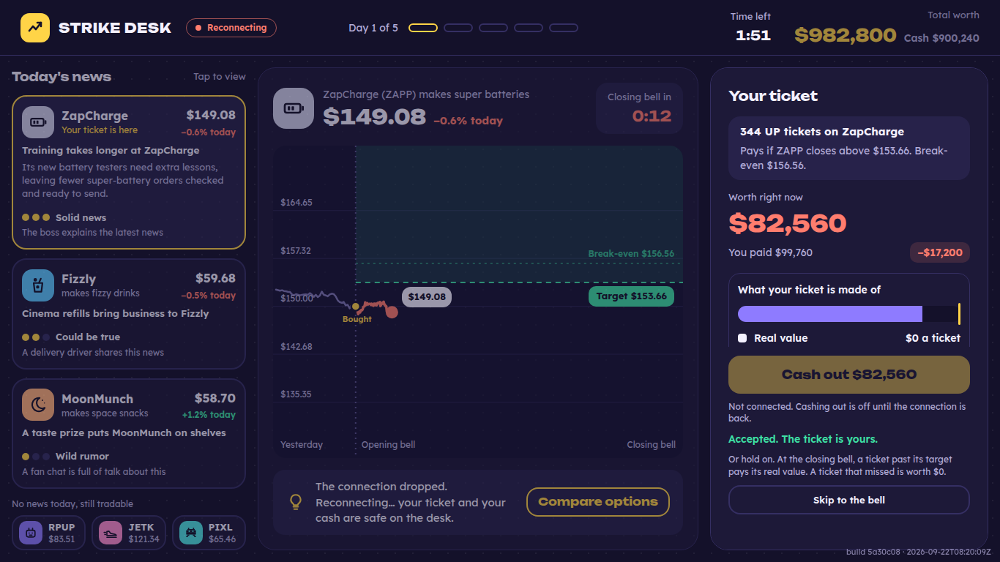

# Strike Desk

A fifteen-minute trading game for kids, built as a small, honest client-server application.

You start with $1,000,000 of pretend money and five trading days. Each day, six made-up companies are on the desk and three of them have a headline: solid news, something that could be true, or a wild rumor. You buy an **UP ticket** if you think a company's share price will climb past a **target**, or a **DOWN ticket** if you think it will drop below one, and you decide when to **cash out** or hold to the **closing bell**. A ticket is worth its **real value** (how far the price is past the target right now) plus its **hope value** (what the time still to run is worth), and hope melts to nothing by the bell. For teachers: an UP ticket is a call option, a DOWN ticket is a put option, the target is the strike price, and the closing bell is expiry.

Under the game is a Node server that owns the clock, the market, every order and the money, streaming the whole picture to a React desk five times a second: six share prices, 252 live option contracts, one ticket a day, and everything stays correct through a dropped connection.

Live at **https://strike-desk.onrender.com** (a free instance; the first visit after a quiet spell can take half a minute to wake).



<details>
<summary>More screens: Compare options, the final screen, a dropped line</summary>




</details>

## How it fits together

```
 browser (apps/web)                             server (apps/server)
 ┌──────────────────────────────┐   WebSocket   ┌──────────────────────────────┐
 │ screens/  desk, ticket, chart│◄── frames ────│ sampler: 5 whole frames/s    │
 │ store/    one frame, series  │   (the whole  │ door: parse, check, answer   │
 │ modules/  connection, grid,  │    picture)   │ sessions: game + clock offset│
 │           order-ticket rules │── commands ──►│ command path ─┐              │
 └──────────────────────────────┘  (with ids)   └───────────────┼──────────────┘
                                                                ▼
                                                 packages/shared (pure, seeded)
                                                 market · board · pricing · news
                                                 game rules · frame projection
```

- **`packages/shared`** is the whole simulation as pure functions: a seeded market, a board of 21 targets per company, the option pricing, headlines assembled from parts, and the game rules (`applyCommand(game, command, step)`). No `Math.random`, no `Date.now`; time and seed are inputs, and a lint fence keeps it that way. The same seed gives the same market, so a game can be replayed exactly.
- **`apps/server`** owns time and money. A session is a market identity, a start time, a few clock offsets and the accepted commands; "the price now" is a lookup from elapsed time, and a ticket past its bell is settled the next time anyone reads the game. Every command carries a client-made id and gets an explicit receipt: accepted, or rejected with a reason. A repeated id gets the original receipt and does nothing else. Frames carry only what has already happened: no future prices, no unrevealed news outcomes; the market's seed is shown after the game, never during it.
- **`apps/web`** displays what it is told and sends requests. Nothing in it computes a price, a cost or a payout; every amount on screen is a number the server sent. The connection keeps every unanswered command, marks it "checking" when the line drops, settles it from the receipts on the next frame after a reconnect, and resends it under the same id when that is safe. The contract table is AG Grid Community fed through its async transaction API, with sorting paused while the pointer is over it so rows never jump under a click.

## Running it

Node 24 and pnpm 12 (`corepack enable` picks the pinned version up).

```sh
pnpm install --frozen-lockfile
pnpm dev                 # server on :10000, Vite dev page on :5173
pnpm typecheck && pnpm lint && pnpm test && pnpm build
pnpm start               # the built server serving the built page on :10000
```

Two switches on the page address, neither of them for players: `?dev` shows a "Drop the line" button in the top bar to demonstrate the reconnect, and `?board=2500` asks the server for a 2,508-contract board (the same board with finer target spacing) with a measurements readout above the table. Buying is off while a stress board runs, so it can never touch a real game's money.

## Numbers, labelled for what they measure

One run each, headless Chromium (Playwright 1194) on a Linux cloud container, Node 24.21, on 2026-09-22. The readout's own definitions are on the page (click any label).

| Board | Received quote records/s | Real changes/s | Client delay, typical / worst 5% | Frame interval, typical / worst 5% | Tasks over 50 ms in 10 s |
|---|---|---|---|---|---|
| 2,508 contracts (`?board=2500`), market open, 1× pace | 11,247 | 10,845 | 65 ms / 72 ms | 16.7 ms / 16.8 ms | 0 |

"Client delay" is the time from a quote arriving on the socket to the first animation frame in which the changed price is visible in a Price cell: a proxy for drawing latency that excludes the network and is not physical paint time. The normal 252-contract board is not a performance claim and is not measured; it is small on purpose, because every row has to help a player decide something.

Test suite at the time of writing: 1,373 tests in 61 files across the engine, the server and the client, including a determinism fixture (the same seed must reproduce the same prices bit for bit), a replay of a recorded game, an end-to-end reconnect test against the real service over a real socket, and a component test that filters the table while quotes stream and checks the half-built ticket is untouched.

## What is and is not recoverable

- **A dropped connection: recoverable.** The page reconnects with a growing wait, says hello with the session it had, and takes the next frame. An unanswered buy or cash-out is settled from that frame's receipts; if the server never saw it and the press is under twenty seconds old, the page sends it again under the same id. The end-to-end test does both and ends with one ticket and the right cash.
- **A page reload: recoverable.** The session id lives in the tab's session storage, so a reload resumes the game; a second tab is a second game.
- **A server restart: not recoverable.** Sessions are in memory. A session is a small record (market identity, start time, clock offsets, accepted commands), so saving it to a file or SQLite would make restart recovery nearly free; that is deliberately not built.

## One engineering trade-off

**Every server message is the whole picture.** Five times a second the server sends a client its entire view: clock, account, tickets, revealed news, six prices, and one price for every contract with its real and hope parts and its break-even, about 10 KB at 252 contracts. The alternative, sending only what changed, would cut most of that traffic. It would also create classes of message that must never be dropped or reordered, a reconnect handshake to work out what was missed, and a way for the page's picture to drift from the server's. With whole frames, any frame may be dropped, a reconnect is "take the next frame", and the page holds the ordering triple (session, revision, step) and nothing older. The stress board is the one exception: at thousands of contracts the server sends changed quotes only, with a whole frame every second and a half, and the page merges a batch only into the exact board it was cut from.

## Art

The company marks are generated: a tile in each company's own tint holding a small line glyph drawn by hand in SVG (a robot head, a fizzy cup, a jet sneaker, a crescent moon, a pixel creature, a battery). No illustrations, no licensed art. The fonts, Lexend and Unbounded, are bundled with the page so the game works on a school network that blocks font hosts.

## Honesty note

This is a simulation: a small, internally consistent market built from a seed, not a model of any real one. The numbers above are measurements of this program in one environment, not claims about hardware or browsers in general.
